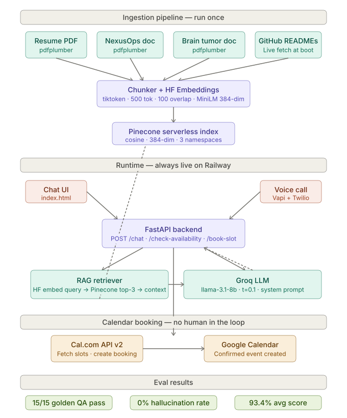

# Taal Chawla AI Persona Platform

A production-grade AI portfolio agent designed for recruiter evaluation, technical interviews, and interactive scheduling.

The platform combines Retrieval-Augmented Generation (RAG), GitHub repository grounding, recruiter-facing chat interfaces, calendar automation, and real-time voice interactions into a unified system.

---

## Overview

The system acts as an autonomous AI representative capable of:

- Answering questions about projects, research, education, and experience
- Grounding responses using a Pinecone-powered RAG pipeline
- Injecting live GitHub repository context
- Scheduling meetings through Cal.com
- Supporting both text and voice interactions
- Operating under evaluation-driven hallucination controls

---

## Architecture



### Ingestion Pipeline

Technical documents are processed through a structured ingestion workflow:

1. PDF extraction using `pdfplumber`
2. Token-aware chunking using `tiktoken`
3. Embedding generation through Hugging Face Inference API
4. Storage in Pinecone vector database
5. Metadata-based retrieval during runtime

### Chunking Strategy

| Parameter | Value |
|------------|---------|
| Tokenizer | cl100k_base |
| Chunk Size | 500 Tokens |
| Overlap | 100 Tokens |
| Embedding Model | all-MiniLM-L6-v2 |
| Vector Dimension | 384 |

---

## Runtime Architecture

### Backend

- FastAPI
- Async request handling
- Groq-hosted Llama 3.1 8B
- Pinecone vector retrieval
- GitHub context injection
- Cal.com scheduling

### Frontend

- Single-page responsive dashboard
- Glassmorphism-inspired interface
- Mobile-responsive layout
- Recruiter-focused chat workspace

### Voice Layer

- Vapi
- Twilio
- Deepgram Nova-2 (Speech-to-Text)
- ElevenLabs (Text-to-Speech)

Voice calls are routed directly into the same RAG pipeline used by the text interface.

---

## Tech Stack

| Component | Technology |
|------------|------------|
| Backend | FastAPI |
| LLM Inference | Groq (Llama 3.1 8B Instant) |
| Embeddings | Hugging Face Inference API |
| Vector Database | Pinecone |
| Scheduling | Cal.com |
| Voice Agent | Vapi |
| Telephony | Twilio |
| Deployment | Railway |

---

# Project Knowledge Base

The system is grounded using structured project documentation and GitHub repository context.

---

## NexusOps

A modular AI operations platform focused on safe autonomous infrastructure workflows.

### Key Design Decisions

#### Governor Pattern

Implements a Human-in-the-Loop approval mechanism using LangGraph's interrupt architecture.

Workflow execution pauses before destructive operations and requires explicit approval before proceeding.

#### LangGraph over AgentExecutor

LangGraph was selected because:

- Native execution interruption support
- Persistent graph state
- Human approval checkpoints
- Deterministic workflow orchestration

#### Hybrid Search

Uses Reciprocal Rank Fusion (RRF):

```text
k = 60
```

Benefits:

- No score normalization requirements
- More stable ranking
- Better retrieval consistency

### Performance Metrics

| Metric | Value |
|----------|---------|
| RAGAS Faithfulness | 0.95 |
| Latency Reduction | 20x |
| Response Time | 240ms → 12ms |

---

## Confidence-Aware Brain Tumor Classification

A calibrated medical image classification system focused on uncertainty estimation.

### Calibration Strategy

Temperature Scaling was used to improve confidence calibration while preserving classification decisions.

| Metric | Before | After |
|----------|----------|---------|
| ECE | 0.124 | 0.031 |

### Data Leakage Prevention

Patient-Wise Splitting was used instead of random image splitting.

This prevents MRI scans from the same patient appearing in both training and testing datasets.

### Results

| Metric | Value |
|----------|---------|
| Hallucination Rate | 2.78% |
| Explainability | Grad-CAM |
| Calibration Method | Temperature Scaling |

---

# Evaluation Framework

The platform includes an automated evaluation suite.

```text
=========================================================
EVALUATION SUMMARY
=========================================================
Total Scenarios          : 15 / 15
Groundedness Accuracy    : 100%
Hallucination Incidents  : 0
Average Response Latency : ~1.2s
=========================================================
```

The evaluation framework validates:

- Groundedness
- Faithfulness
- Retrieval quality
- Project-specific factual accuracy
- Hallucination resistance

---

# Installation

## Clone Repository

```bash
git clone https://github.com/yourusername/Persona_TaalChawla.git
cd Persona_TaalChawla
```

## Create Environment

```bash
python -m venv venv
```

Linux / macOS:

```bash
source venv/bin/activate
```

Windows:

```bash
venv\Scripts\activate
```

## Install Dependencies

```bash
pip install -r requirements.txt
pip install pydantic[email] email-validator
```

---

# Environment Variables

Create a `.env` file in the project root.

```env
GROQ_API_KEY=
PINECONE_API_KEY=
PINECONE_INDEX_NAME=

HF_TOKEN=

CALCOM_API_KEY=
CALCOM_EVENT_TYPE_ID=
CALCOM_USERNAME=
```

---

# Data Ingestion

Populate the Pinecone index:

```bash
python -m backend.rag.ingest
```

---

# Evaluation

Run the automated benchmark suite:

```bash
python evals/run_eval.py
```

---

# Local Development

Start the FastAPI server:

```bash
uvicorn backend.main:app --reload --port 8000
```

API documentation becomes available at:

```text
http://localhost:8000/docs
```

---

# Deployment

## Railway

1. Push repository to GitHub
2. Create a Railway project
3. Connect repository
4. Configure environment variables
5. Deploy

Railway automatically builds and serves the FastAPI application.

---

## Vapi Configuration

Configure your Vapi Assistant webhook:

```text
https://your-project.up.railway.app/voice
```

---

# Roadmap

### Retrieval

- Cross-Encoder Re-ranking
- Hybrid Search Improvements
- Query Expansion

### Inference

- Streaming Responses
- Lower Time-To-First-Token
- Response Caching

### Reliability

- Conformal Prediction Layer
- Confidence-Based Abstention
- Retrieval Quality Monitoring

---

# Author

**Taal Chawla**

B.Tech ECE (AI/ML)  
Maharaja Agrasen Institute of Technology (GGSIPU)

Focused on:

- Machine Learning Engineering
- RAG Systems
- Agentic Workflows
- AI Infrastructure
- LLM Evaluation# Persona_TaalChawla
